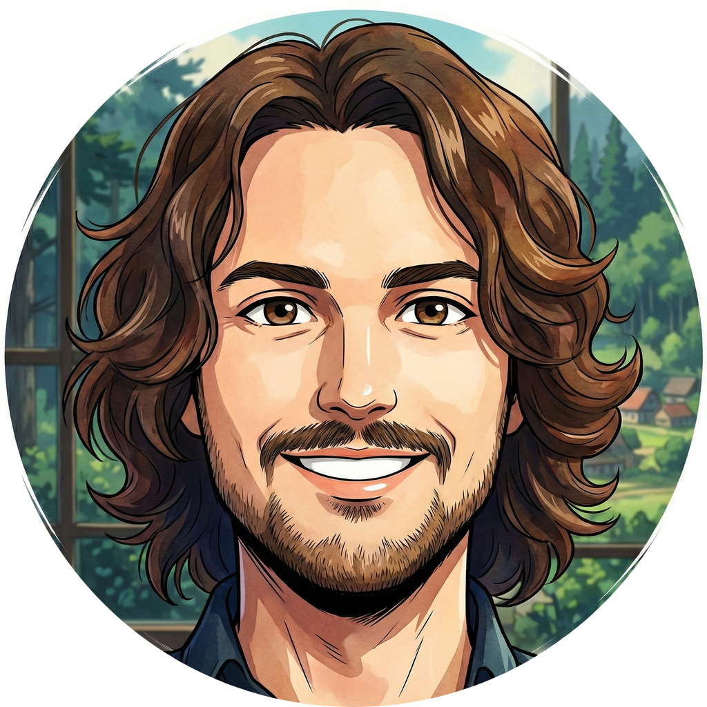

 
 

# About me

Hi, I'm Sebastian — a developer from Germany. When I'm not writing code, I'm probably playing guitar. I believe great software, like great music, is all about finding the right harmony between tools and intent.

Reach out to me: <https://www.viridianblue.com/contact>

CheckMyGit: <https://checkmygit.com/sebastian-ederer>

## 🛠️ Languages and tools

    

